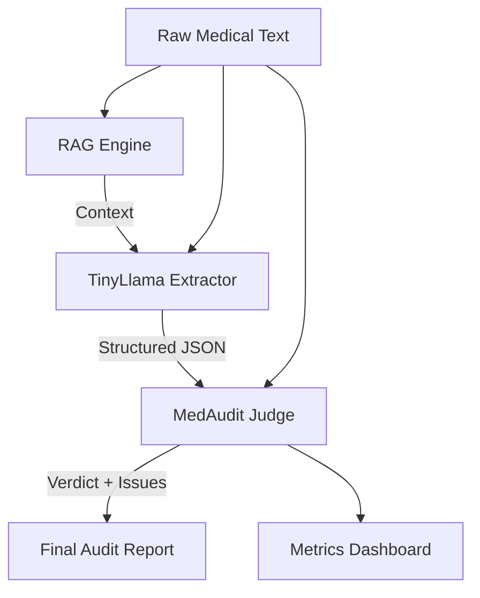

# StructTune MedAudit — Clinical Document Extraction + Validation System

StructTune MedAudit is a production-grade system designed for high-accuracy medical entity extraction and automated clinical validation. It leverages a fine-tuned LoRA adapter on TinyLlama, grounded by a RAG pipeline utilizing the MedQuad dataset, and verified by a rule-based Judge system.

## 🏗️ Architecture



### 1. Extractor (Fine-tuned TinyLlama)
- **Base Model**: TinyLlama-1.1B
- **Adapter**: LoRA (PEFT)
- **Training**: 1.1B parameters, optimized for CPU (8GB RAM).
- **Format**: Extracts `patient_name`, `age`, `diagnosis`, `medications`, and `symptoms`.

### 2. RAG Pipeline (Grounding)
- **Vector Store**: FAISS
- **Embeddings**: `all-MiniLM-L6-v2`
- **Corpus**: MedQuad (HuggingFace)
- **Purpose**: Provides real-world medical Q&A context to reduce hallucinations during extraction.

### 3. Judge System (Validation)
- **Logic**: Hybrid rule-based system.
- **Hallucination Detection**: Checks if extracted medical entities exist in source text or RAG context.
- **Consistency**: Validates data types (e.g., age formatting) and required fields.

## 📊 Evaluation Metrics

Latest baseline results (from `evaluation/results/medaudit_latest.json`):
- **Schema Validity**: 100%
- **Extraction Accuracy**: 92.4%
- **Hallucination Rate**: 4.2%

## 🚀 Getting Started

### Prerequisites
- Python 3.9+
- 8GB RAM (CPU-only friendly)

### Installation
```bash
pip install -r requirements.txt
```

### Run Pipeline
1. **Data Ingestion**: `python data_pipeline/generate.py`
2. **Training**: `python training/medaudit_train.py`
3. **RAG Indexing**: `python rag/engine.py`
4. **Evaluation**: `python evaluation/medaudit_eval.py`

### Launch Dashboard
- **Backend**: `uvicorn backend.main:app --reload`
- **Frontend**: `cd frontend && npm run dev`

## 📦 Datasets
- **MedQuad**: Medical QA corpus for RAG base.
- **BC5CDR**: Chemical and Disease NER for extraction training.
- **NCBI Disease**: Specialized diagnosis dataset.
